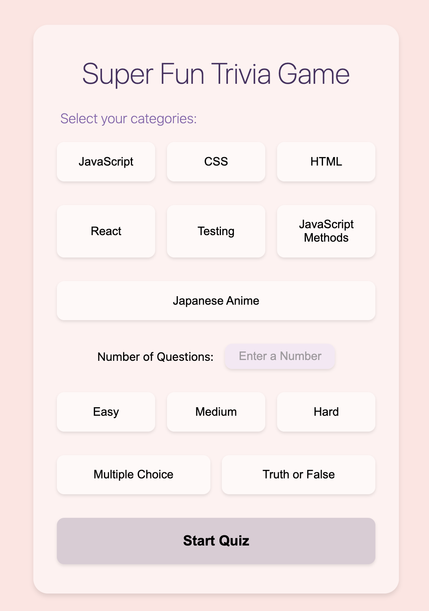
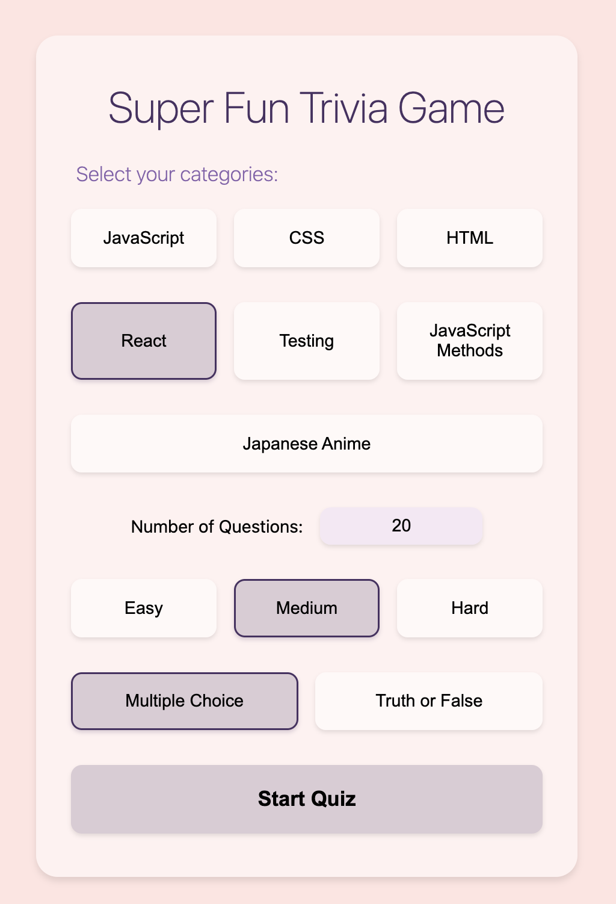
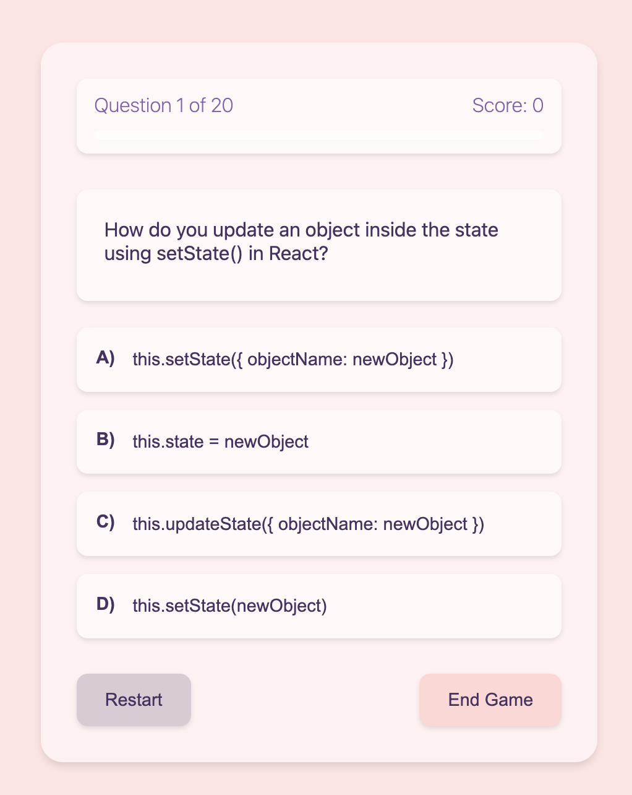
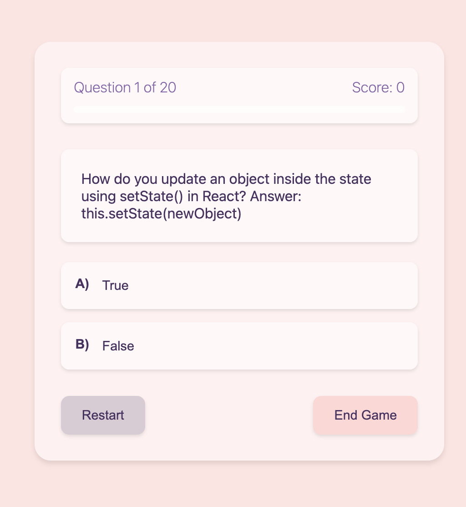
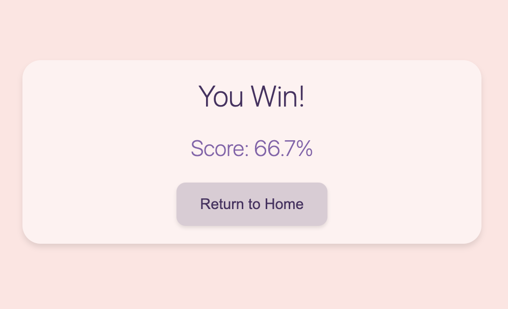
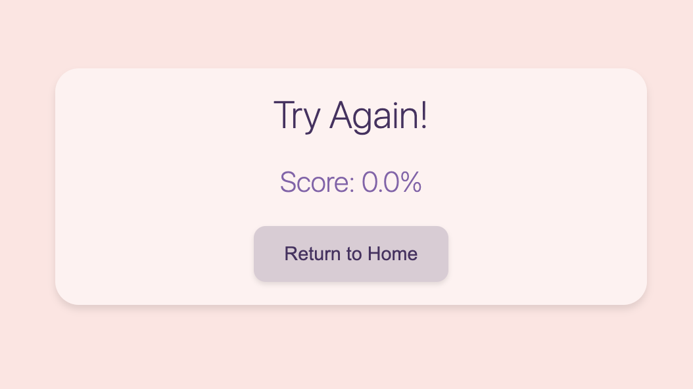

# Ami's Trivia Game

A modern web-based trivia game built with React and Node.js that lets you test your knowledge across various categories.

## Features

- Multiple categories to choose from
- Different difficulty levels (Easy, Medium, Hard)
- Question types including Multiple Choice and True/False
- Real-time scoring
- Interactive user interface

## Game Screenshots

### Starting Screen


### Category Selection


### Question Types
Multiple Choice Questions            |  True/False Questions
:-------------------------:|:-------------------------:
  |  

### Game Results
Win Screen (≥65% correct)            |  Lose Screen (<65% correct)
:-------------------------:|:-------------------------:
  |  

## Prerequisites

Before you begin, ensure you have the following installed:
- Node.js (v14 or higher)
- npm (usually comes with Node.js)

## Installation

1. Clone the repository:
```bash
git clone https://github.com/amilia-n/Techtonica-Weekly-Projects.git
cd Week\ 8\ Trivia\ Game
```

2. Install server dependencies:
```bash
cd server
npm install
```

3. Install client dependencies:
```bash
cd ../client
npm install
```

## Running the Application

1. Start the server in a terminal:
```bash
cd server
npm start
```

2. In a new terminal, start the client:
```bash
cd client
npm run dev
```

The application should now be running at `http://localhost:5173`

## Development

To run tests (in the client directory):
```bash
npm test
```

## How to Play

1. **Start a Game**
   - Select your preferred categories from the available options
   - Choose a difficulty level (Easy, Medium, or Hard)
   - Select question type (Multiple Choice or True/False)

2. **During the Game**
   - Read each question carefully
   - Select your answer from the provided options
   - Submit your answer to proceed to the next question
   - Track your score as you progress

3. **Game End**
   - Win condition: Score 65% or higher of total questions
   - Lose condition: Score below 65% of total questions
   - Option to start a new game with different settings

## Technologies Used

- Frontend: React, Vite
- Backend: Node.js, Express
- Testing: Jest, React Testing Library
- API: Open Trivia Database (OpenTDB)

## Contributing

1. Fork the repository
2. Create your feature branch (`git checkout -b feature/AmazingFeature`)
3. Commit your changes (`git commit -m 'Add some AmazingFeature'`)
4. Push to the branch (`git push origin feature/AmazingFeature`)
5. Open a Pull Request

## License

This project is licensed under the MIT License - see the LICENSE file for details.